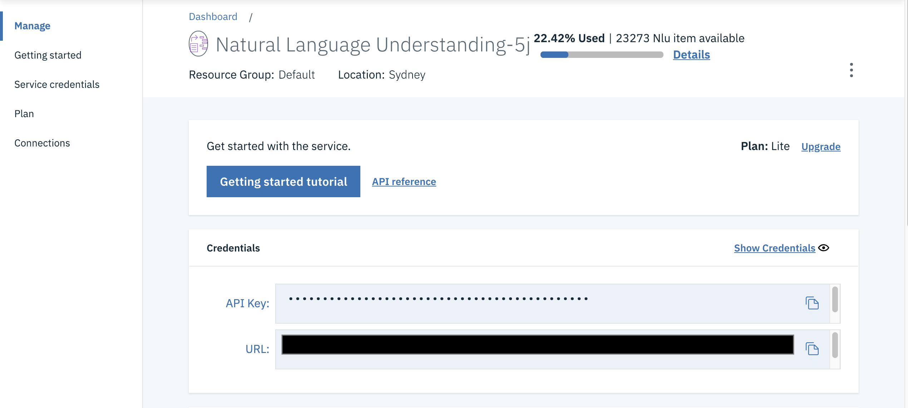
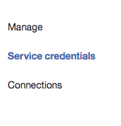
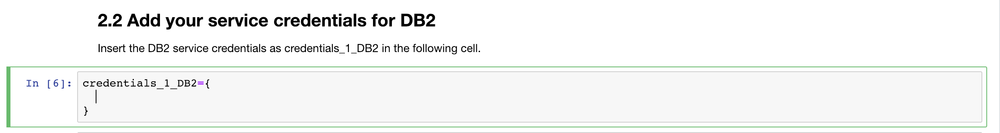
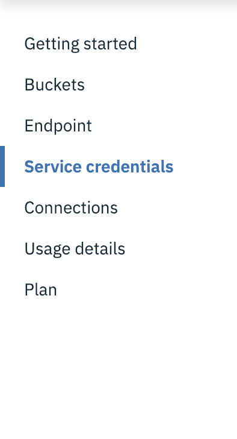
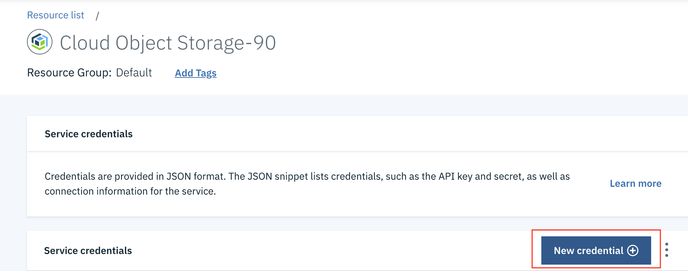
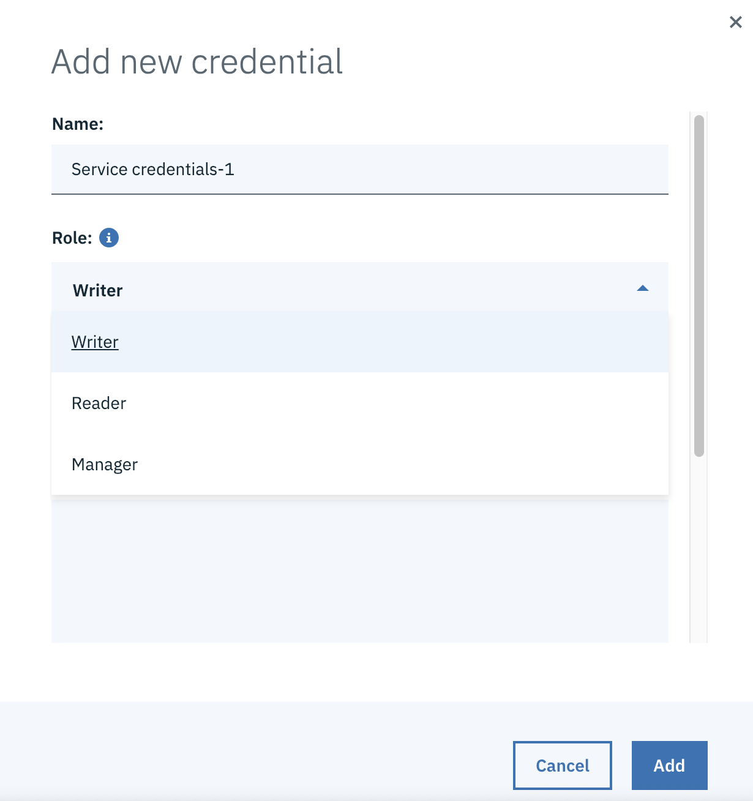
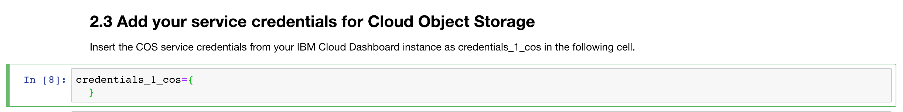

# Scrape and Store Startup Data in DB2 Warehouse

1. [Create Watson services with IBM Cloud](#1-create-watson-services-with-ibm-cloud)
2. [Create a Project on Watson Studio](#2-create-a-project-on-watson-studio)
3. [Configure credentials](#3-configure-credentials)
4. [Run the Notebook](#4-run-the-notebook)

### 1. Create Watson services with IBM Cloud

Create the following services:
* [**Watson Studio**](https://cloud.ibm.com/catalog/services/watson-studio)
* [**Watson Natural Language Understanding**](https://cloud.ibm.com/catalog/services/natural-language-understanding)
* [**DB2 Warehouse**](https://cloud.ibm.com/catalog/services/db2-warehouse)
* [**Object Storage**](https://cloud.ibm.com/catalog/services/cloud-object-storage)

### 2. Create a Project on Watson Studio

* Login to [IBM Cloud Dashboard](https://cloud.ibm.com/resources).
* Click the dropdown to `Services` and select on `Watson Studio`
* Click `Get Started` button at the bottom of the page.

* Select the `New Project` option from the Watson Studio landing page and choose the `Standard` option.

* To create a project in Watson Studio, give the project a name and select the Cloud Object Storage service created.

* Upon a successful project creation, you are taken to a dashboard view of your project. Take note of the `Assets` and `Settings` tabs, we'll be using them to associate our project with any external assets (datasets and notebooks) and any IBM cloud services.

### Create a Notebook

* Click on the `Add to project` tab and select `Notebook`.

* Click on the `From URL` tab and enter the notebook url from the repo- `Insert Link`

* Select the free runtime.
* Click the `create` button.

### 3. Configure credentials

1. [Add the Natural Language Understanding service credentials](#1-add-the-natural-language-understanding-service-credentials)
2. [Add the DB2 Warehouse service credentials](#2-add-the-db2-warehouse-service-credentials)
3. [Add the Object Storage service credentials](#3-add-the-object-storage-service-credentials)

#### 1. Add the Natural Language Understanding service credentials

* Open the Watson Natural Language Understanding service under `Service` dropdown in your [IBM Cloud Dashboard](https://cloud.ibm.com/resources).
* Once the service is open copy the `apikey` and `url` in the `Credentials` menu.
* Select the cell below `2.1 Add your service credentials from IBM Natural Language Understanding service` section in the notebook to update the credentials for Watson Natural Language Understanding.

* Update the `apikey` and `url` key values in the cell below `2.1 Add your service credentials from IBM Cloud for the Watson services` section.

#### 2. Add the DB2 Warehouse service credentials

* Open the DB2 Warehouse service under `Cloud Foundry Services` dropdown in your [IBM Cloud Dashboard](https://cloud.ibm.com/resources).
* Click on `Service Credentials` from the options given on the left.

* Click on `View credentials` and copy the credentials.
* In the notebook, scroll to `2.2 Add your service credentials for DB2` and paste the copied credentials in the variable `credentials_1_DB2`.

#### 3. Add the Object Storage service credentials
* Open Object Storage under `Storage` dropdown in your [IBM Cloud Dashboard](https://cloud.ibm.com/resources).
* Click on `Service Credentials` from the options given on the left.

* Click on the `New Credentials` option.

* Click on `Writer` option under Role and give any name of your choice.

* Once created, click on `View Credentials` and copy the credentials.
* In the notebook, scroll to ` 2.3 Add your service credentials for Cloud Object Storage` and paste the copied credentials in the variable `credentials_1_cos`.

## 4. Run the Notebook

When a notebook is executed, what is actually happening is that each code cell in
the notebook is executed, in order, from top to bottom.

Each code cell is selectable and is preceded by a tag in the left margin. The tag
format is `In [x]:`. Depending on the state of the notebook, the `x` can be:

* A blank, this indicates that the cell has never been executed.
* A number, this number represents the relative order this code step was executed.
* A `*`, this indicates that the cell is currently executing.

There are several ways to execute the code cells in your notebook:

* One cell at a time.
  * Select the cell, and then press the `Play` button in the toolbar.
* Batch mode, in sequential order.
  * From the `Cell` menu bar, there are several options available. For example, you
    can `Run All` cells in your notebook, or you can `Run All Below`, that will
    start executing from the first cell under the currently selected cell, and then
    continue executing all cells that follow.
* At a scheduled time.
  * Press the `Schedule` button located in the top right section of your notebook
    panel. Here you can schedule your notebook to be executed once at some future
    time, or repeatedly at your specified interval.
