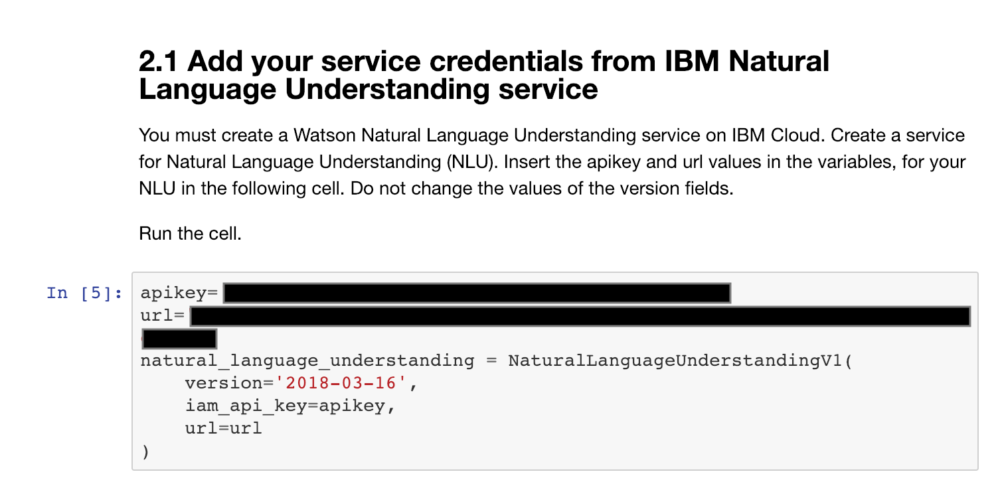
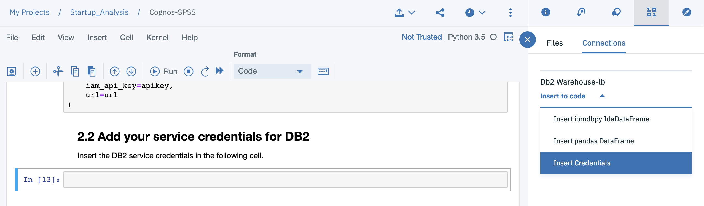
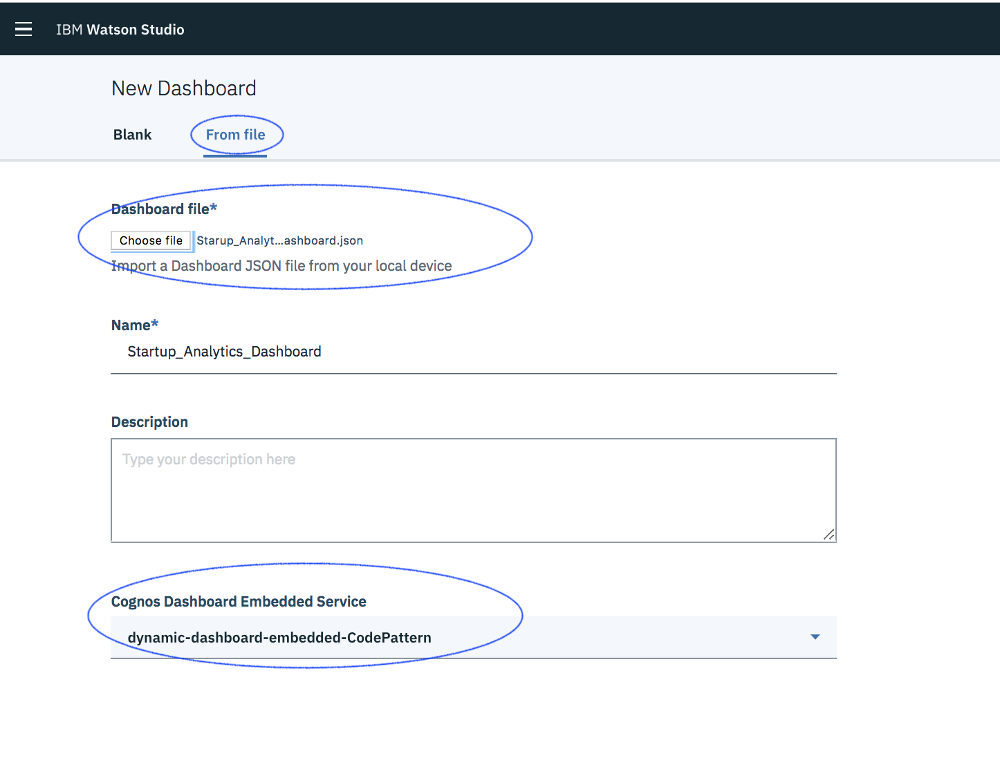
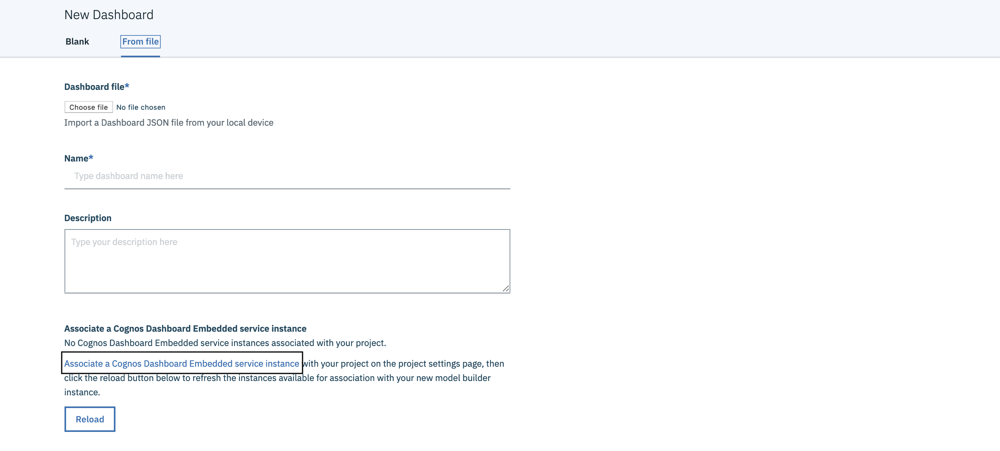
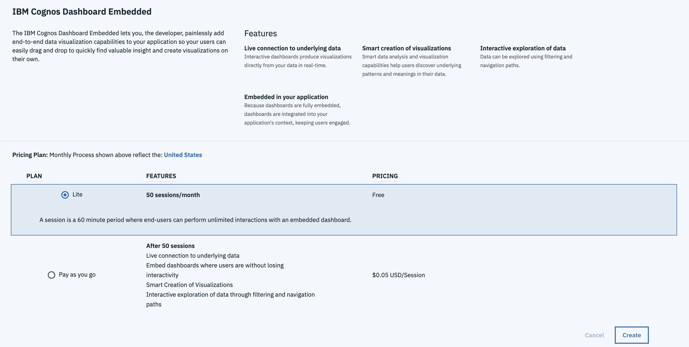
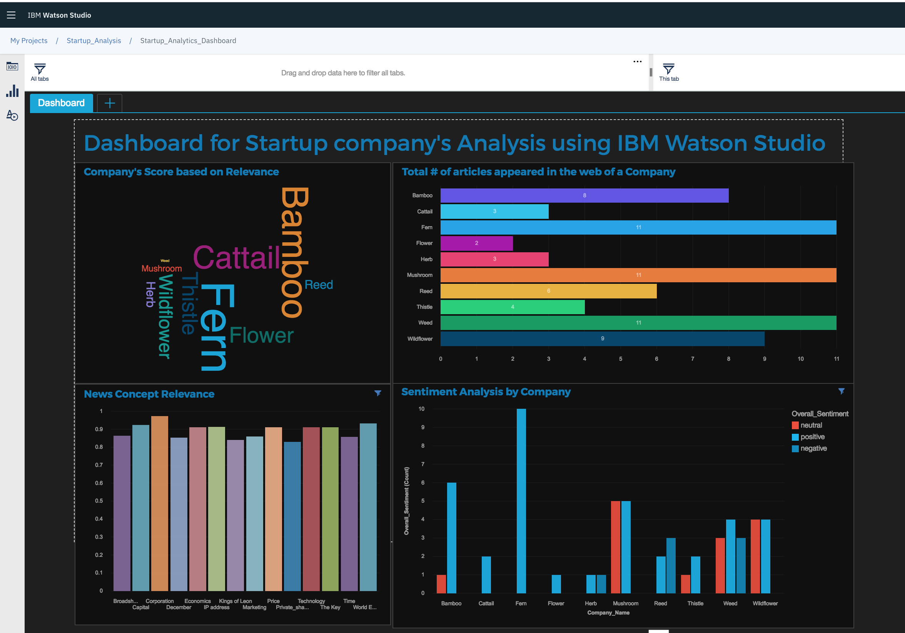

# Scrape, Analyze and Visualize insights on Raw Data From the Web using Watson Studio

The World Wide Web or the "Web" is the universe of network-accessible information. All this information present in a raw format on the Web. What if you want a way to ingest raw information on the web for any given topic and provide insights and visualiations for the same. This code pattern does, just that taking an example of performing analytics on Startups.

Being in the age of start-ups. There is a rapid increase in a number of companies providing skilled services. We can scrape information about such companies and evaluate their success stories based on the number of articles or live use cases appeared in news portals.

Suppose, we want to understand the current startups in a particular technology, say Machine Learning, this code pattern will evaluate its impact in the industry, on the basis of:

* How many times it has appeared on News?
* Whether it has a Wikipedia page or not?
* Whether they have Tech blogs or not?
* Whether they are active on Social Media (Twitter, Medium, etc..)?

This unstructured data once scraped (extract information from web) is processed through Watson NLU and converted to structured data. This is fed to SPSS, which can be used to understand the data and perform Analytics to determine if all the factors (as mentioned above) appear in a company, thereby computing a popularity score. Once, all the Analytics is performed this Code Pattern also provides a user friendly and interactive Dashboard visualisation of the data, giving insights of the data and complete ease to simplify the decision making process.

> **NOTE**: Company names have been anonymised and replaced with names of Plants so as to not put down any one company, but rather provide a methodology to perform analytics on data from the web.

When the reader has completed this Code Pattern, they will understand how to:

* Create and Run a Python Notebook on Watson Studio.
* Scrape data using BeautifulSoup.
* Use Watson Natural Language Understanding to extract metadata from Python Notebook.
* Generate a CSV and Convert to a Table in Db2 Warehouse.
* Load and analyze data in SPSS Modeler.
* Load and Visualize data in the Embedded Dashboard.

## Flow


1. The user creates and runs a Python Notebook on Watson Studio.
2. The Notebook scrapes latest news on Startups.
3. The Scraped Information is sent to Watson Natural Language Understanding to extract Keywords, Entities, Sentiments and its respective confidence scores.
4. The Results of NLU are compiled into a csv file which is further converted to a table in Db2 Warehouse.
5. The table created is ingested in SPSS to do some analytics and return a score against each company. The updated table is then saved back to Db2 Warehouse.
6. Finally, the table generated in Db2 Warehouse is fed to the Dashboard, giving insightful visualisation.

## Watch the Video

[](https://www.youtube.com/watch?v=AqX9D2I9nJw)

## Prerequisites

* [Scrape data from the web using Python and AI](https://developer.ibm.com/tutorials/scrape-data-from-the-web-using-watson-studio/)
* [Predictive analytics using SPSS with database warehouse connection](https://developer.ibm.com/tutorials/set-up-spss-modeler-on-watson-studio-with-db2-warehouse-connection/)
* A filled out [companies_list.json](https://github.com/IBM/analyze-insights-on-startup-using-watson-studio/blob/master/companies_list.json), see below for more information.

**[companies_list.json](companies_list)**

This JSON file contains a list of companies you want to analyze. The format is shown below, follow the template and each company in the list will be analyzed.

```json
{
  "companies": [
    {
      "Company_Name_1": [
        "Company_Description_1",
        "Company_URL_1"
      ]
    },
    {
      "Company_Name_2": [
        "Company_Description_2",
        "Company_URL_2"
      ]
    }
  ]
}
```
```
Note: Pls do not enter more than 10 companies in the json file. 
```
## Steps

1. [Setup the Notebook on your Watson Studio Project](#1-setup-the-notebook-on-your-watson-studio-project)
2. [Setup the SPSS Modeler on your Watson Studio Project](#2-setup-the-spss-modeler-on-your-watson-studio-project)
3. [Setup the Embedded Dashboard on your Watson Studio Project](#3-setup-the-embedded-dashboard-on-your-watson-studio-project)

### 1. Setup the Notebook on your Watson Studio Project

#### Importing the notebook

* Once, you have created your Waston Studio Project, click on `Add Notebook`>`From URL` and copy this URL:

```ini
https://github.com/IBM/analyze-insights-on-startup-using-watson-studio/blob/master/code/Scrape_Startup_Insights.ipynb
```

#### Configuring IBM Cloud services

* Ensure you have created and copied the Watson Natural Language Understanding service as instructed in the [Scrape data from the web using Python and AI](https://developer.ibm.com/tutorials/scrape-data-from-the-web-using-watson-studio/), and paste the service credentials in your notebook in the cell below `2.1 Add your service credentials from IBM Cloud for the Watson services`.

  

* Ensure you have created and connected your Db2 Warehouse instance to the current Watson Studio Project as instructed in the [Predictive analytics using SPSS with database warehouse connection](https://developer.ibm.com/tutorials/set-up-spss-modeler-on-watson-studio-with-db2-warehouse-connection/), and insert the credentials in the section `2.2 Add your service credentials for Db2`. Ensure the credentials is saved as `credentials_1`.

  

* In your `credentials_1` variable note down the `username` field, like DASHXXXX. This will be later used in various instances in this pattern.

* In the notebook go to the last section `Store and Add table in Db2 Warehouse`, and replace `DASHXXXX` with the your schema name.

  

#### Adding your [companies_list.json](companies_list) data

* Download the file [companies_list.json](https://github.com/IBM/analyze-insights-on-startup-using-watson-studio/blob/master/companies_list.json) and modify it to look up companies you want to analyze.

* On the top right corner click on the `10/01` tab, click on `browse`, and choose the newly modifies `companies_list.json` file.

* In section 3 of the notebook, the cell under `Insert Pandas Dataframe of the company_list.json file`. Ensure the dataframe is saved as `df_data_1`.

#### Run the notebook

* Click the play button in Watson Studio to run the notebook.

> **NOTE**: Since Data is being scraped from the web certain cells in the notebook will take some time to execute.

### 2. Setup the SPSS Modeler on your Watson Studio project

* Download the [Analyze_Startup_Data.str](https://github.com/IBM/analyze-insights-on-startup-using-watson-studio/blob/master/code/Analyze_Startup_Data.str) stream file from the repo.

* Open your Watson Studio from IBM Cloud Dashboard and Navigate to the created project.

* Click on the `Add to Project` button and select `Modeller Flow`.

  

* Click on the `From File` tab and upload the downloaded stream file.

  

* Once, the modeler is opened. Double Click on the `Data Asset` node and click on the `Change Data Asset` button.

   

* Move to `Connection` tab and select the `Db2 Warehouse` and select the correct `Schema` (usually starting with `DASHXXXX`) and the created table `DATA_FOR_SPSS`.

  

* Similarly for the final node, `Data_Export`, follow the same steps as above and select the `DATA_FOR_COGNOS` table.

  

* Before saving the changes for the node, make sure the value for `If the datset already exists` is set to `Replace the data set`, as shown in the image above.

* Run the Modeler Flow, by clicking the play button. The data would now be saved back to your Db2 Warehouse instance.

```
Note: At this stage you may receive an error of DB2Exception CLI0109E String data right truncation SQLSTATE 22001. This may due to unusually long URLs. However, you can treat it as a Warning and go ahead with the next steps.
```

### 3. Setup the Embedded Dashboard on your Watson Studio Project

* Download the [Starup_Analytics_Dashboard.json](https://github.com/IBM/analyze-insights-on-startup-using-watson-studio/blob/master/code/Starup_Analytics_Dashboard.json) config file and open it in any editor.

  * Search for the term `DASH_SCHEMA_NAME` and replace any occurrences of it with your Db2 Warehouse schema name.

    

  * If you have changed the table name from `DATA_FROM_COGNOS` search for the term `DATA_FOR_COGNOS` and replace any occurrences of it with your Db2 Warehouse table name.

    

* Go to your Watson Studio project and click on `Add to Project` button to add the Embedded Dashboard Analytics service.

  

* Select `From file` option to upload the modified `Starup_Analytics_Dashboard.json` file, select the dashboard service and then click on save.

  

If you don't have the `Cognos Dashboard Embedded Service` instance perform the following steps:

* Click on `Associate a Cognos Dashboard Embedded Service Instance`.

  

* Choose the `Lite` or `Pay-as-you-go` plan as per your requirement and click on `Create`.

  

* Click on `Reload` and then `Create` button.

* Next, Click on `Connections`>`Db2 Warehouse`>`Your_Schema`>`DATA_FOR_COGNOS`. This will load the Interactive Dashboard.

> **NOTE**: While opening the Dashboard you may receive a warning about missing data, if this happens click on the `Re-link` button.
>
> 

## Sample output

This Code Pattern provides a solution:

* That extracts live unstructured data about startups
* The impact startups create in the industry with the help of Watson Natural Language Understanding and converted to a structured data.
* The data is then fed into IBM SPSS Predictive Analytics to get meaningful insights and ratings.
* Finally, providing insights and visualisation from the provided input using Watson Embedded Dashboard.

The end-to-end Startup Analytics Dashboard provides users complete insights on startups and showcases the predicted information in the form of charts/widgets using IBM Watson Embedded Dashboard Service which hosted on Watson Studio.
This enables a user to build their own sophisticated visualizations to communicate the insights from their discovered analytics data, furthermore the created dashboard can be shared among various users.

After completing the setup, you will see the dashboard with four interactive widgets as follows:



1. Company score based on relevance: A view showing the most popular companies at a larger size than the smaller ones.
2. Total number of articles appeared in the web of a company: A view showing the factors affecting the popularity of a startup on the web (amongst news articles, tech blogs, social media and so on).
3. News Concept Relevance: Gives a broad overview of main topics of the articles across the companies, by the percentage of its relevance.
4. News Sentiment Analysis by Company: Gives an overall analysis of the tone in which the article was written, to understand the impact (whether positive or negative or neutral) a given company has in the industry.

## Troubleshooting

See [TROUBLESHOOTING.md](https://github.com/IBM/analyze-insights-on-startup-using-watson-studio/blob/master/TROUBLESHOOTING.md).

## License

This code pattern is licensed under the Apache License, Version 2. Separate third-party code objects invoked within this code pattern are licensed by their respective providers pursuant to their own separate licenses. Contributions are subject to the [Developer Certificate of Origin, Version 1.1](https://developercertificate.org/) and the [Apache License, Version 2](https://www.apache.org/licenses/LICENSE-2.0.txt).

[Apache License FAQ](https://www.apache.org/foundation/license-faq.html#WhatDoesItMEAN)
