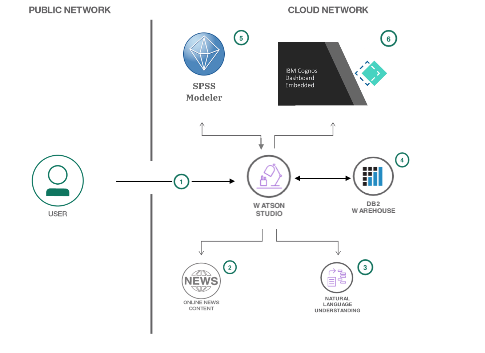

# Scrape, Analyze and Visualize insights on Startups using Watson Studio

Being in the age of start-ups. There is a rapid increase in a number of companies providing skilled services. We can scrape information about such companies and evaluate their success stories based on the number of articles or live use cases appeared in news portals.

This Code Pattern provides a tool that extracts live unstructured data about Startups and the impact they create in the industry with the help of Watson Natural Language Understanding, fed into IBM SPSS Predictive Analytics to get meaningful insights and predictions, finally fed into Cognos Dashboard which provides insights and visualisation from the provided input.

When the reader has completed this Code Pattern, they will understand how to:

* Create and Run a Python Notebook on Watson Studio.
* Scrape data using BeautifulSoup.
* Use Watson Natural Language Understanding to extract metadata from Python Notebook.
* Generate a csv and Convert to a Table in DB2 Warehouse.
* Load and analyze data in SPSS Modeler.
* Load and Visualize data in Cognos Dashboard.

<!--add an image in this path-->

<!--Optionally, add flow steps based on the architecture diagram-->
## Flow

1. The user creates and runs a Python Notebook on Watson Studio.
2. The Notebook scrapes latest news on Startups.
3. The Scraped Information is sent to Watson Natural Language Understanding to extract Keywords, Entities, Sentiments and its respective confidence scores.
4. The Results of NLU are compiled into a csv file which is further converted to a table in DB2 Warehouse.
5. The table created is ingested in SPSS to do some analytics and return a score against each company. The updated table is then saved back to DB2 Warehouse.
6. Finally, Cognos ingests, the final table generated in DB2 Warehouse giving insightful visualisation.

<!--Optionally, update this section when the video is created-->
# Watch the Video

Insert Video

# Steps
The code pattern is split into 3 steps:

1. [**Data Preparation**](Data_Preparation.md)
2. [**Analyze using SPSS**](Analyze_using_SPSS.md)
3. [**Visualize in Cognos**](Visualize_in_Cognos.md)

# Sample output

<!--Optionally, include any troubleshooting tips (driver issues, etc)-->

# Troubleshooting

## License

This code pattern is licensed under the Apache License, Version 2. Separate third-party code objects invoked within this code pattern are licensed by their respective providers pursuant to their own separate licenses. Contributions are subject to the [Developer Certificate of Origin, Version 1.1](https://developercertificate.org/) and the [Apache License, Version 2](https://www.apache.org/licenses/LICENSE-2.0.txt).

[Apache License FAQ](https://www.apache.org/foundation/license-faq.html#WhatDoesItMEAN)
