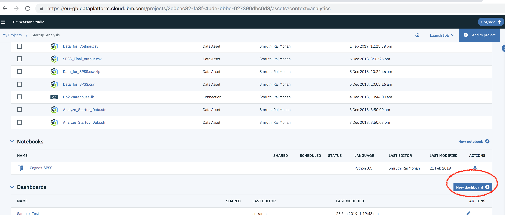

# Startup Company analysis Dashboard 

Startup analysis Dashboard provides user a complete Insights and showcases the Predicted information in the form of charts/widgets using IBM Watson Embedded Dashboard Service which hosted on Watson Studio. 
You can build sophisticated visualizations of your analytics results, communicate the insights that you've discovered in your data on the dashboard and then share the dashboard with others.

#### Key Features of IBM Cognos Dashboard Embedded are as follows:

- Live connection to underlying data
- Interactive dashboards produce visualizations directly from your data in real-time.
- Smart creation of visualizations
- Smart data analysis and visualization capabilities help users discover underlying patterns and meanings in their data.
- Interactive exploration of data
- Data can be explored using filtering and navigation paths.
- Embedded in your application
- Because dashboards are fully embedded, dashboards are integrated into your application's context, keeping users engaged.

In this pattern we have used this service to consume the derived insights (from db2 warehouse) followed by interactive dashboards which produces visualizations directly from your data in real-time.

User can create and visulaize the data in the form of 4 widgets as follows:

1. Company's Score based on Relevance
2. Total number of articles appeared in the web of a Company
3. News Concept Relevance
4. News Sentiment Analysis by Company

* This widget gives you the insights of the company's score based on the relevance score that is been predicted by the SPSS model.

* 

## Steps to create the Dashboard 

### (i) Provisioning a Dashboard Embedded analytics service Instance to the Watson Studio Project

* Click on `Add to Project` button to add the Embedded Dashboard Analytics service.

### (ii) Create a New Dashboard by importing `Starup_Analytics_Dashboard.json` file.

*  Click on New Dashboard under Dashboard asset to create a dashboard. See screenshot for details.

* Select `From file` option to upload the dashboard file(`./code/Starup_Analytics_Dashboard.json`) and select the dashboard service and then click on save.

* After importing the json file, you will see the dashboard with 4 interactive widgets as follows:

### (iii) Analyzing the dashboard which has 4 widgets

Following are the Four widgets that can be created:

1. Company's Score based on Relevance
2. Total number of articles appeared in the web of a Company
3. News Concept Relevance
4. News Sentiment Analysis by Company

This widget gives you the insights of the company's score based on the relevance score that is been predicted by the SPSS model.
